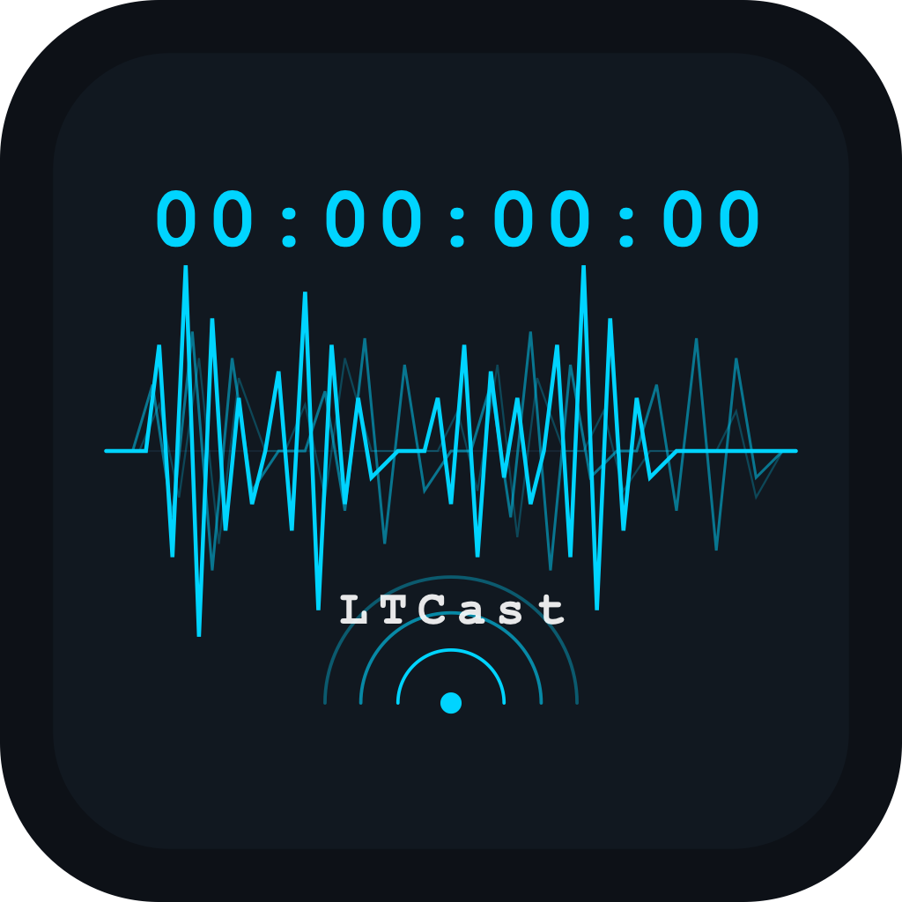

# LTCast

<p align="center">
  
</p>

**Professional LTC Timecode player and MTC/Art-Net sender for live shows.**

LTCast reads SMPTE LTC timecode embedded in audio files and forwards it as MTC (MIDI Timecode) and Art-Net Timecode over the network. It features a robust dual-audio engine, advanced setlist automation, and a built-in LTC utility generator.

Designed for live show operators, lighting programmers, and AV engineers who need reliable timecode distribution from a single playback machine.


---

## 🚀 Key Features

- **LTC Reader** — Real-time SMPTE decoding with auto-channel detection.
- **MTC Output** — Sends MIDI Timecode (Quarter-frame and Full-frame SysEx) to any MIDI port.
- **Art-Net Timecode** — Broadcasts timecode via UDP (port 6454) for lighting consoles (MA, Hog, etc.).
- **Built-in LTC Generator** — Create custom LTC WAV files directly within the setlist panel.
- **Advanced Setlist** — Manage multiple tracks with drag-and-drop reordering and renaming.
- **Autoplay & Routing** — Continuous playback mode and custom "Next Track" follow actions.
- **Per-Track Settings** — Individual Start TC, Offset (frames), and Mode (Reader vs Generator) per track.
- **Resizable Interface** — Flexible sidebars (Setlist & Devices) with persistent layout saving.
- **Cue Sheet Export** — Export your entire show setlist to a professional Excel (.xlsx) sheet.
- **Video Import** — Import video; LTCast aligns its audio to the main track using waveform cross-correlation.
- **Dual Audio Output** — Separate routing for music and LTC signals to prevent device conflicts.
- **Preset System** — Save/load entire show states as `.ltcast` project files.

## 🛠 Supported Formats

WAV, AIFF, MP3, FLAC, OGG, and video (via audio extraction).

## 💻 System Requirements

- **Windows 10+** (Recommended for dual-device routing) / **macOS 12+** (Apple Silicon native)
- **Virtual MIDI**: [loopMIDI](https://www.tobias-erichsen.de/software/loopmidi.html) (Win) or IAC Driver (macOS)
- **Virtual Audio**: [VB-CABLE](https://vb-audio.com/Cable/) (Win) or [BlackHole](https://existential.audio/blackhole/) (macOS)

---

## 🔄 Recent Updates & Bug Fixes

### Version 0.3.x (Current)
- **[Feature] LTC Generator**: Integrated an inline utility to generate blank or LTC-filled audio files directly into the setlist.
- **[Feature] Follow Actions**: Added ability to route any track to jump to another specific track or "Stop" automatically upon completion.
- **[Feature] Resizable Panels**: Implemented draggable Setlist and Device sidebars that remember their width across sessions.
- **[Feature] Cue Sheet Export**: New header button to export setlist data (Start/End TC, Durations) to Excel.
- **[Improvement] Per-Track Persistence**: Start TC, Generator Mode, and Offsets are now stored individually per setlist item.
- **[Fix] Autoplay Policy**: Patched the Electron engine to allow "Auto Play Next" to trigger audio without manual user interaction.
- **[Fix] Mode Stickiness**: Clicking "TC Generator" now locks that track into generator mode, preventing auto-detect from switching it back to Reader unnecessarily.
- **[Branding]**: Unified branding to **LTCast** (formerly LTCast X PIXLPLAY).

### Version 0.2.x
- **Dual AudioContext Engine**: Implemented separate routing for Music and LTC to solve "Locked Handle" errors on Windows/VB-CABLE.
- **High-Res Waveforms**: Added high-performance waveform rendering for large audio files.
- **Video Alignment**: Implemented cross-correlation algorithm for matching video audio to master tracks.

---

## 👩‍💻 Development

```bash
# Install dependencies
npm install

# Run in development mode
npm run dev

# Build (renderer + main + preload)
npm run build

# Package installer
npm run package:win      # Windows (.exe)
npm run package:mac      # macOS (.dmg)
```

## ⚖ License

[Commons Clause + MIT](LICENSE)

Free for personal and commercial use. Redistribution or resale of the software itself is not permitted.
