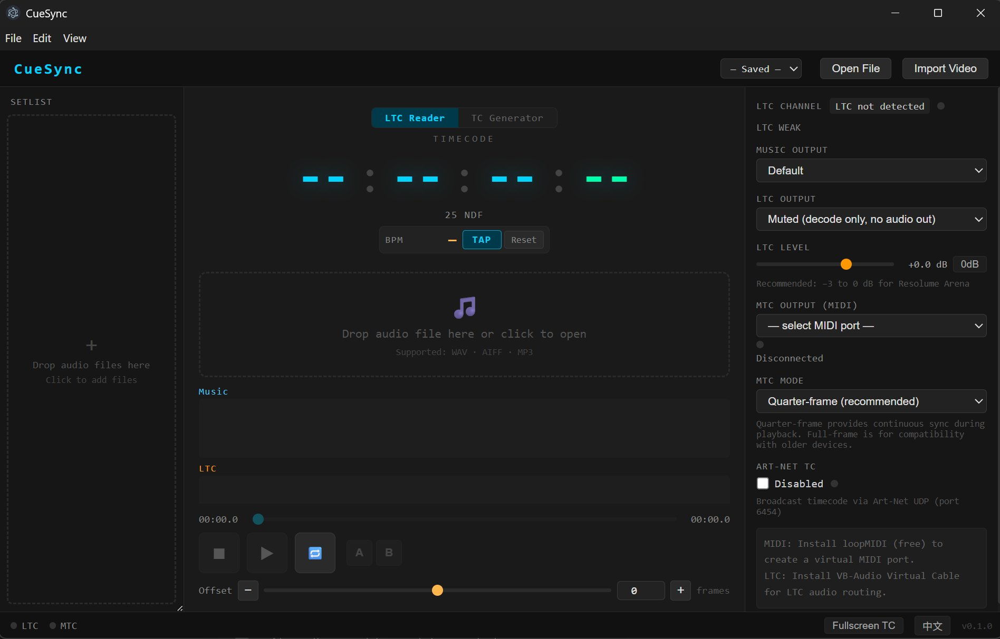

# LTCast

<p align="center">
  
</p>

**用於現場演出的 LTC 時間碼播放器與 MTC / Art-Net 時間碼發送工具。**

LTCast 可讀取音訊檔案中內嵌的 SMPTE LTC 時間碼，並轉發為 MTC（MIDI 時間碼）與 Art-Net Timecode。對於無內嵌 LTC 的檔案，也提供 TC 產生器模式。

專為現場演出操作人員、燈光程式設計師與 AV 工程師設計，讓你從單一播放機器可靠地分發時間碼。



---

## 功能

- **LTC 讀取器** — 自動偵測 LTC 聲道，即時解碼 SMPTE 時間碼
- **MTC 輸出** — 透過任何 MIDI 埠發送 MIDI 時間碼（Quarter-frame 與 Full-frame SysEx）
- **Art-Net 時間碼** — 透過 UDP（埠 6454）廣播時間碼
- **TC 產生器** — 為無內嵌時間碼的檔案產生 LTC 音訊
- **雙音訊輸出** — 音樂與 LTC 可分別路由至不同裝置（如 VB-CABLE）
- **曲目列表** — 管理多個音訊檔案，支援拖放排序
- **A-B 循環** — 循環播放指定區段
- **影片匯入** — 匯入影片後，LTCast 使用波形互相關演算法自動對齊影片音訊與主音軌。可在波形上拖曳進行精細調整。
- **預設系統** — 儲存/載入專案設定為 .ltcast 檔案
- **Tap BPM** — 手動拍點偵測 BPM 工具
- **雙語介面** — English / 繁體中文

## 支援格式

WAV、AIFF、MP3、FLAC、OGG

## 系統需求

- Windows 10+ / macOS 12+（Apple Silicon）
- Node.js 22+（開發用）
- MTC 輸出需要虛擬 MIDI 埠（Windows 使用 [loopMIDI](https://www.tobias-erichsen.de/software/loopmidi.html)，macOS 使用 IAC Driver）
- LTC 輸出需要虛擬音訊線（Windows 使用 [VB-CABLE](https://vb-audio.com/Cable/)，macOS 使用 [BlackHole](https://existential.audio/blackhole/)）

> **macOS 注意：** 首次開啟若出現「無法驗證開發者」警告，請至**系統設定 → 隱私權與安全性**點選**仍要打開**。若出現「已損毀」警告，在終端機執行以下指令，再重新開啟：
> ```bash
> xattr -cr /Applications/LTCast.app
> ```

## 開發

```bash
# 安裝依賴
npm install

# 開發模式執行
npm run dev

# 建構（renderer + main + preload）
npm run build

# 打包安裝程式
npm run package          # 當前平台
npm run package:win      # Windows
npm run package:mac      # macOS
```

## 架構

```
src/
├── main/           Electron 主程序（IPC、檔案 I/O、Art-Net UDP、ffmpeg）
├── preload/        Context bridge（安全的 IPC API）
└── renderer/src/
    ├── audio/      音訊引擎（雙 AudioContext、LTC worklets、MTC、Art-Net）
    ├── components/ React UI 元件
    ├── store.ts    Zustand 狀態管理
    ├── i18n.ts     國際化（en/zh）
    └── globals.css 樣式
```

**關鍵設計決策：**

- **雙 AudioContext** — 音樂與 LTC 使用獨立的 AudioContext，各自路由至不同裝置。避免 Windows 上 VB-CABLE 句柄遺失問題。
- **AudioWorklet** — LTC 解碼與編碼在 AudioWorklet 處理器中執行，確保即時效能。
- **Quarter-frame MTC** — MTC 以 quarter-frame 訊息發送，透過 Web MIDI 的 `send(data, timestamp)` 預排程確保計時精確。Seek/Jump 時改用 Full-frame SysEx 重置接收端位置。
- **Drop-frame 時間碼** — 在解碼器與產生器中完整實作 SMPTE 12M drop-frame 演算法（29.97fps）。

## 問題回報與聯繫

- **GitHub Issues**：[提交問題](https://github.com/xyproai-bot/CueSync/issues)
- **Email**：xyproai-bot@gmail.com

## 授權

[Commons Clause + MIT](LICENSE)

個人與商業演出使用免費。不允許將本軟體重新包裝販售。
